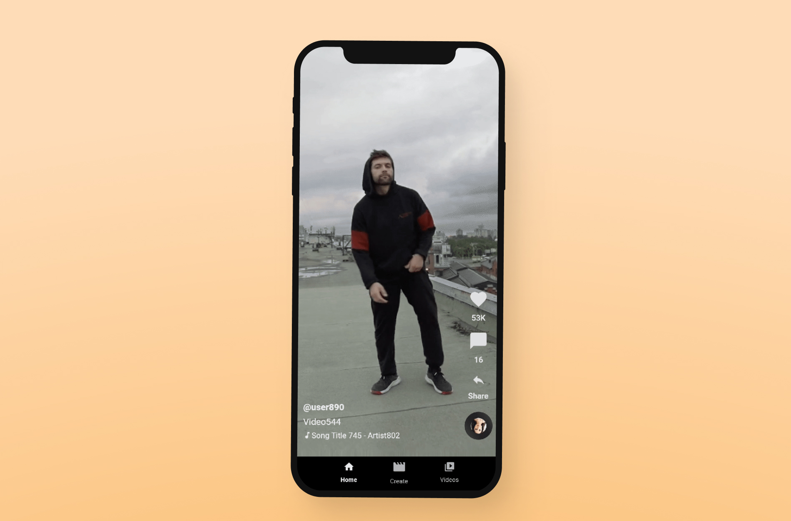
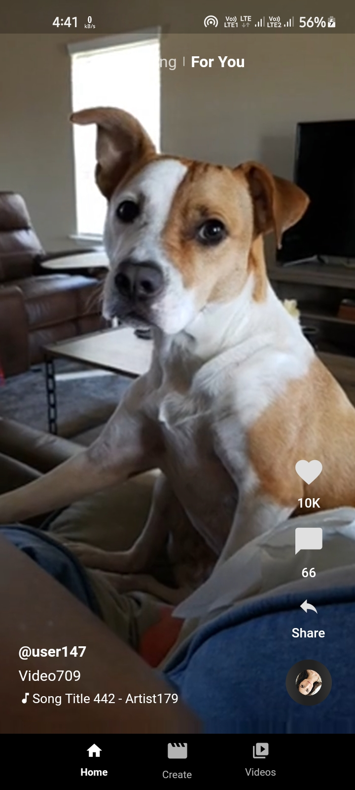
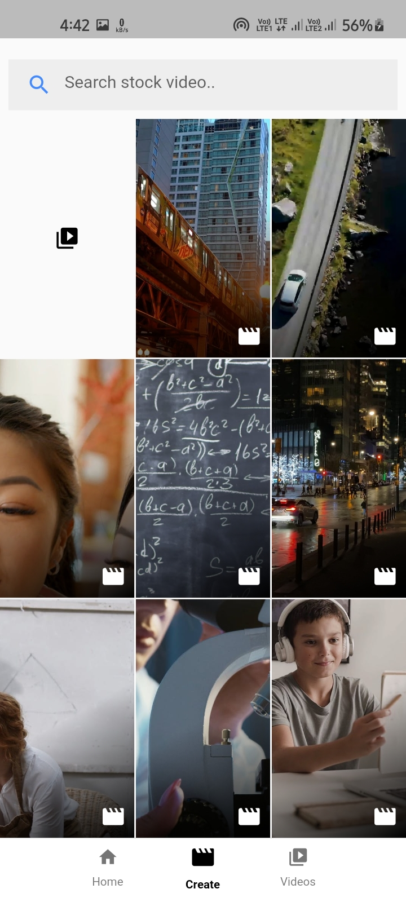
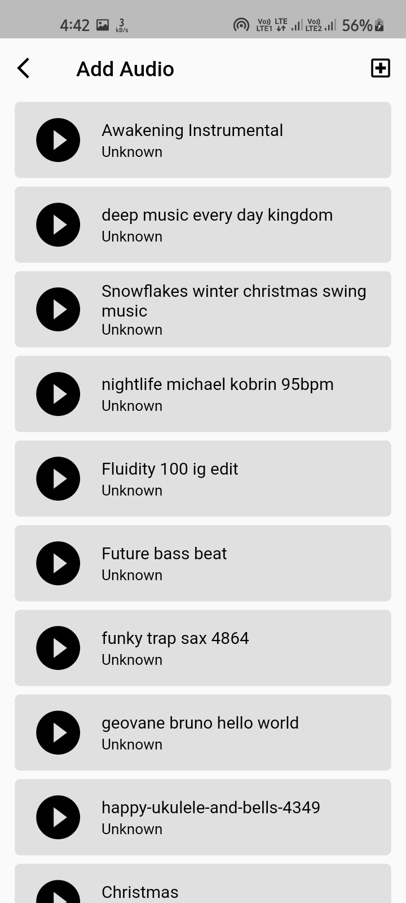
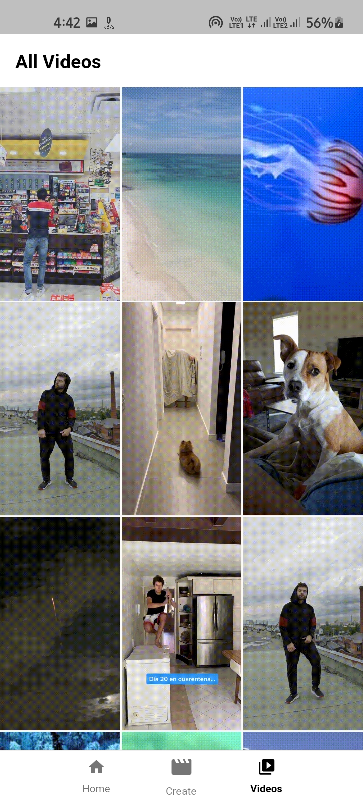

<h1 align="center">
    <br>
    Flutter Short Videos Platform
</h1>

<h4 align="center">
 Short videos platform with Flutter and Firebase.
</h4>
<hr>
<p align="center">
  
  
  

</p>
<br/>
<p align="center">
    
</p>

<p align="center">
  
  
  
  
  
  

</p>

## About

Real short video app with firebase and pixels API.Where you can create a short video with pixels' stock videos and also merge your audio.

## Dependencies<br/>

- cached_network_image: ^3.1.0
- cached_video_player: ^2.0.0-dev.1
- cloud_firestore: ^2.5.1
- cupertino_icons: ^1.0.2
- file_picker: ^4.0.1
- firebase_core: ^1.6.0
- firebase_storage: ^10.0.3
- flutter_bloc: any
- flutter_cache_manager: ^3.1.2
- flutter_ffmpeg: ^0.4.2
- get_it: ^7.2.0
- http: ^0.13.3
- image_picker: ^0.8.4
- just_audio: ^0.9.10
- path_provider: ^2.0.3
- stacked: ^2.2.5
- syncfusion_flutter_sliders: ^19.2.59
- uuid: ^3.0.4

## How to use

To clone and run this application, you'll need [Git](https://git-scm.com/downloads) and [Flutter](https://flutter.dev/docs/get-started/install) installed on your computer. From your command line:

### Clone this repository

```
git clone https://github.com/Ansh-Rathod/Flutter-Tiktok-Videos
```

### Go into the repository

```
cd Flutter-Tiktok-Videos
```

### Install dependencies

```
flutter packages get
```

### Run the app

```
flutter run
```
